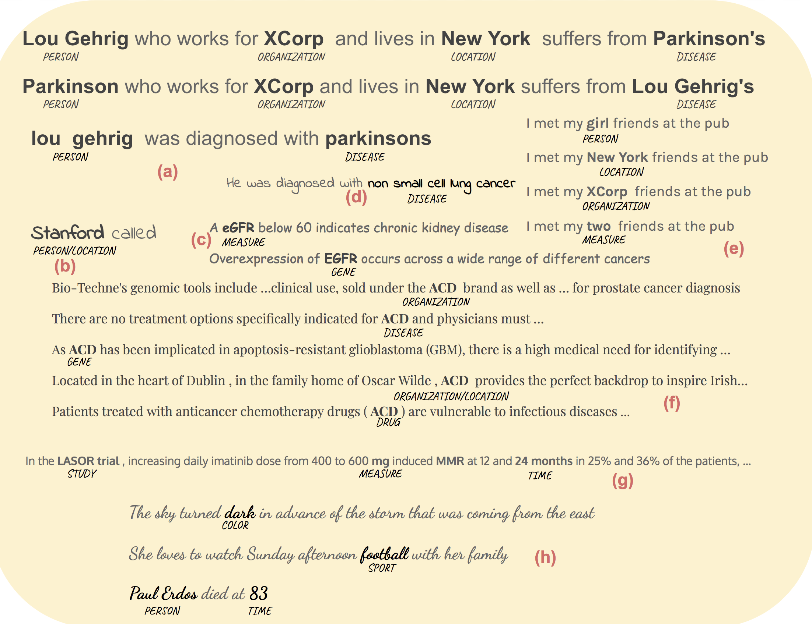
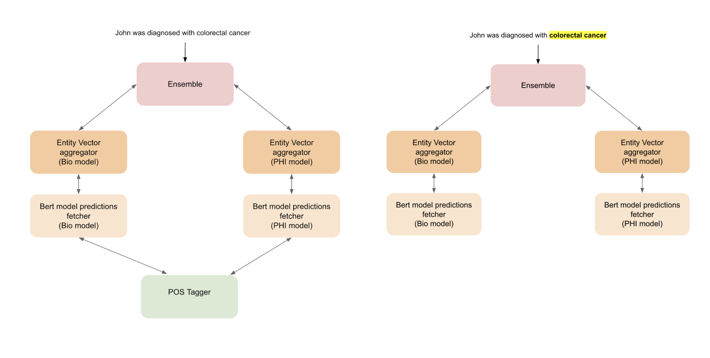
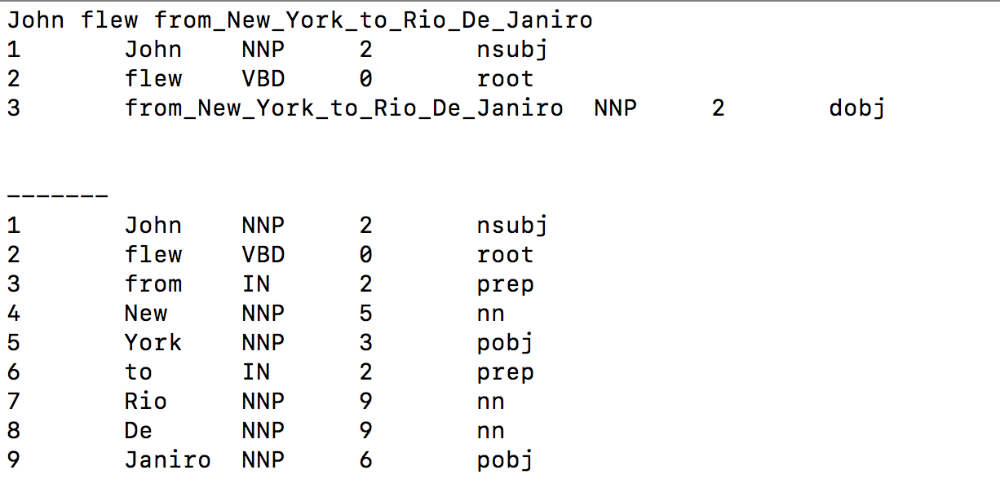
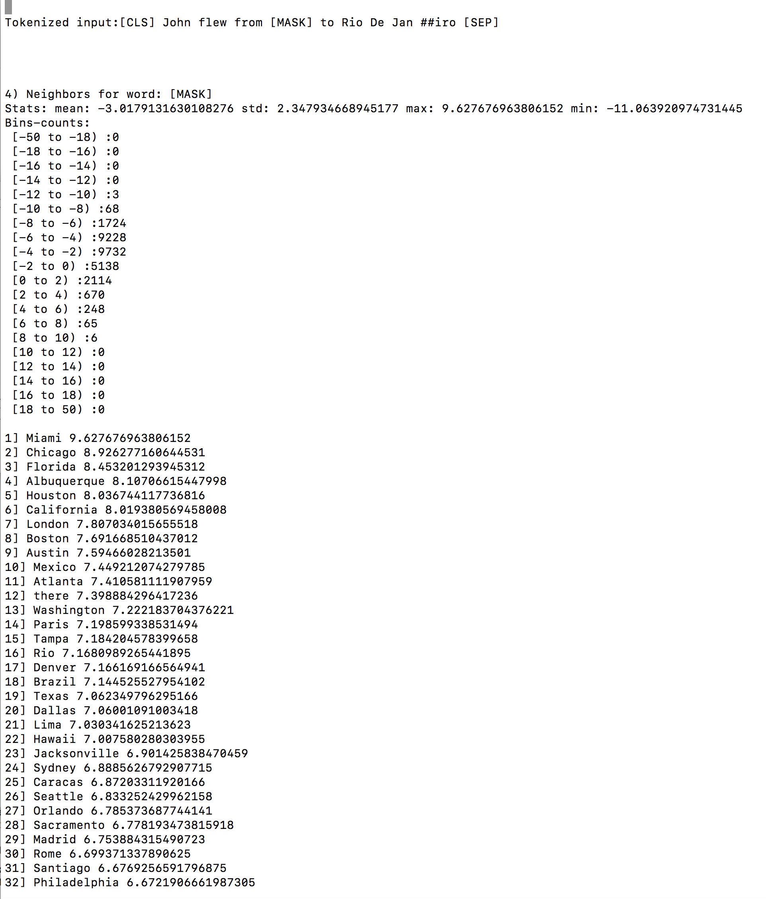

### Self-supervised NER (prototype)

 

*This repository containes code for solving NER  with self-supervised learning (SSL) alone avoiding supervised learning. **It addresses the typical challenges facing any NER model in real world applications applications.** A supervised model in particular requires sufficient labeled sentences to address cases  illustrated in the figure above :- (a) terms whose entity types change based on sentence context (b) sentences with very little context to determine entity type (c) terms whose casing offers cue to the entity type (d) entity type of complete or proper subsets of phrase spans (e) sentences where multiple entity types are possible in a sentence position and only the word in that position offers clue to the entity type (f) a single term that has different meanings in different contexts (g) detecting numerical elements and units (h) recognizing entity types spanning different domains, that  need to be recognized for a use case(e.g. biomedical use of detecting biomedical terms as well as patient identities/health information). Image by Author The examples above are the output of using two BERT models in an ensemble.*

[Post describing the second iteration of this method](https://ajitrajasekharan.github.io/2021/01/02/my-first-post.html)

### Model performance on 11 datasets

<image src="performance.png" width="600">

### Additional links

- [Test repository link](https://github.com/ajitrajasekharan/ner_test.git) used to test this approach
- [Medium post describing the first iteration of this method](https://towardsdatascience.com/unsupervised-ner-using-bert-2d7af5f90b8a)
- To identify noun phrase spans, [Dat Quoc Nguyen's POS tagger/Dependency parser](https://github.com/datquocnguyen/jPTDP) is used.

### Installation 
 
 

 _If the use case is to automatically detect all noun phrase spans in a sentence, then POS tagger needs to be installed. If we only require specific phrases of interest to us in a sentence to be tagged (e.g. colorectal cancer above), then POS tagger install is **not** required. In the first use case, 7 microservices (POS tagger is made up of two microservices)  are started. In the second use, case 5 microservices are started._ 

**1) Install POS service using https://github.com/ajitrajasekharan/JPTDP_wrapper.git**

*Make sure to run **both** services in the install instructions*

Confirm installation works by 

    $ wget -O POS "http://127.0.0.1:8073/John flew from New York to Rio De Janiro"
    
   The output POS file should contain
  
  
  
 
 **2) Install BERT descriptor service using https://github.com/ajitrajasekharan/bert_descriptors.git**
 
 Confirm installation works by 
 
   $ wget -O DES "http://127.0.0.1:8087/dummy/0/John flew from entity to Rio De Janiro"
   
   The output DES file should contain
   
 
 
 

**3) Install BERT vector clustering service using https://github.com/ajitrajasekharan/bert_vector_clustering.git**
 
 Confirm installation works by 
 
  $ wget -O ENT "http://127.0.0.1:8043/Miami Chicago Florida Albuquerque Houston California London Boston Austin Mexico"
  
   The output ENT file should contain
   
   LOC 12 LOC 12 LOC 12 LOC 12 LOC 12 LOC 12 LOC 12 LOC 12 LOC  12 LOC 12
  
 
 
 **Additional notes**
 
 - Step 1 above requires python 2.7 environment wheareas steps 2 and 3 requires python 3+. Step 2 requires pytorch environment. So it is best to run these services separately in different environnments. 
  
 
### Usage

The unsupervised NER tool  can be used in three ways. 

1) to tag canned sentences (option 1)
     - $ python3 main_ner.py 1 
2) To tag custom sentences present in a file (option 2)
    - $ python3 main_ner.py 2 sample_test.txt
3) To tag single entities in custom sentences present in a file (option 3) where the single entity is specified in a sentence in the format name:__ entity __ . Concrete example: Cats and Dogs:__ entity __ are pets where Dogs is the term to be tagged. Single or multiple words/phrases within a sentence can also be tagged. Example: Her hypophysitis:__ entity __ secondary to ipilimumab:__ entity __ was well managed with supplemental:__ entity__ hormones:__ entity __
    - $ python main_NER.py 3 single_entity_test.txt
    
    
    
 ### Revision notes
 
 17 Sept 2021
 
 - This can now be run as a service. run_servers.sh
 - Simple Ensembling service added for combining results of multiple NER servers
  

### License

This repository is covered by MIT license. 

[The POS tagger/Dep parser that this service depends on is covered by a GPL license.](https://github.com/datquocnguyen/jPTDP/blob/master/License.txt)
